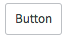
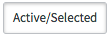
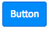
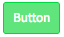
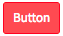
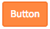
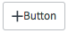
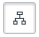
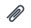
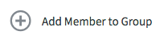

# Button

## Description

Buttons provide a clickable element that allow the user to select actions and interact with the platform. 
<!-- Button classes can be applied on an `<a>`, `<button>`, or `<input>` element.-->

<p><br/><br/><br/><br/></p>

## Button Default
---
Default buttons indicate secondary actions to the user. Default button actions are subordinate to any primary button actions within the view.


```HTML
<button class="btn btn-default">Button</button>
```

#### Active/Selected
---

```HTML
<button class="btn btn-default active">Active/Selected</button>
```

<p><br/><br/><br/><br/></p>

## Button Primary
---
Buttons that can indicate positive, forward-moving actions such as Next and Save.


```HTML
<button class="btn btn-primary">Button</button>
```

#### Success
---

```HTML
<button class="btn btn-success">Button</button>
```

#### Success Subdued
---

```HTML
<button class="btn btn-success-subdued">Button</button>
```

<p><br/><br/><br/><br/><br/></p>


## Button Destructive
---
Buttons that can indicate negative, or destructive actions such as Remove and Delete.


```HTML
<button class="btn btn-destructive">Button</button>
```

#### Destructive Subdued
---

```HTML
<button class="btn btn-destructive-subdued">Button</button>
```

#### Button Warning
---

```HTML
<button class="btn btn-warning">Button</button>
```

<p><br/><br/><br/><br/></p>

## Icon Button
---
Icon buttons with commonly-used, recognizable icons. Include a tooltip on hover to describe the icon button’s action.

Icon buttons can be styled with or without borders.


```HTML
<button class="btn btn-default"><span class="icon icon-add"></span>Button</button>
```

#### Icon Only
---

```HTML
<button class="btn btn-default icon-tree"></button>
```

#### Icon Active/Selected
---

```HTML
<button class="btn btn-default icon-tree active"></button>
```

#### Icon without Border
---

```HTML
<button class="btn btn-default icon-paperclip"></button>
```

<p><br/><br/><br/><br/></p>

### Widget Button
---
Expanding beyond the basics, using the `sn-widget sn-widget-button sn-widget-button_row` classes can provide more design and style to a button.


``` HTML
<div class="sn-widget sn-widget-button sn-widget-button_row">
  <button class="btn btn-default icon">
    <span class="icon-add-circle-empty"></span>
    <span>Add Member to Group</span>
  </button>
</div>
```

<p><br/><br/><br/><br/></p>
