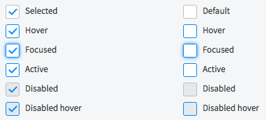
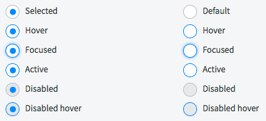
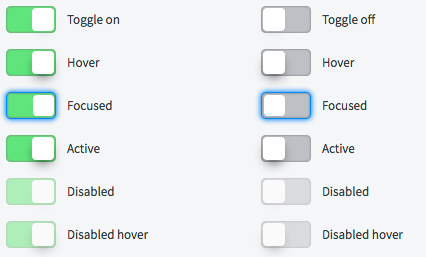

# Choice/Toggle Components (Checkboxes, Radio buttons, Switches)

## Description

Checkboxes, Radio buttons, and Switches provide the user with the ability to make simple _predetermined_ choices.

## Checkboxes
Use checkboxes when presenting the user with a list of one or more options. Checkboxes allow the user to select nothing, one, or multiple options from a list of one or more options.
```HTML
<div class="form-group">
	<span class="input-group-checkbox">
		<input id="checkboxS" class="checkbox" type="checkbox" name="checkboxS">
		<label for="checkboxS" class="checkbox-label">Checkbox Label</label>
	</span>
</div>
```


## Radio Buttons
Use radio buttons when presenting the user with a list of two or more options, but only one possible selection. Clicking an unselected radio button will deselect any previously selected button. Radio buttons allow the user to select only one option from a list of two or more options.
```HTML
<div class="form-group">
	<span class="input-group-radio">
		<input id="radioS" class="radio" type="radio" name="radioS">
		<label for="radioS" class="radio-label">Radio Label</label>
	</span> 
</div>
```


## Switches
Use switches for a single option that the user can toggle on or off. Switches can turn child features in a hierarchy on or off.  Switches allow the user to toggle an option on or off. Use switches to represent boolean options, such as on/off and show/hide.
```HTML
<div class="form-group">
	<div class="input-switch">
		<input id="switchS" type="checkbox" name="switchS">
		<label aria-hidden="true" class="switch" for="switchS"></label>
	</div>
</div>
```

---
## Use Guidelines

Some recommended usage guidelines:

#### Checkboxes
* Group related checkboxes in a list. Break longer lists into logical groups.
* Position checkboxes vertically, with one checkbox per line, to ensure easy-to-understand options.
* If the design requires a horizontal layout with multiple options per line, make sure to clearly group checkboxes with their respective labels.
* Use positive, active text for checkbox labels to ensure clear options.
* To improve ease of use, define access keys for frequently used checkboxes.

#### Radio Buttons
* Use radio buttons rather than dropdown menus whenever possible. When radio buttons are used, all options are permanently visible for easy comparison. likewise, radio buttons are easier to select for users who have difficulty making precise mouse movements.
* Always offer a default selection so that the user can continue without taking action.
* Include clear, distinct options. If more information is required, offer a field for user input.
* Allow the user to select an option by clicking on either the radio button or the label.
* To improve ease of use, define access keys for frequently used checkboxes.
* To improve ease of use, define access keys for frequently used radio buttons.

#### Switches
* Use a switch to display a single option that the user can toggle on or off.
* Use a switch to display a parent option that toggles on/off all child options in one click.
  * To indicate parent/child relationships, indent child labels.
  * When the parent switch is toggled off, collapse child options.

#### Control Labels
* Left-align labels to the left of the control. This improves scannability in longer lists.
* In boolean cases, allow the user to click either the control or the respective label to toggle the option on/off.

