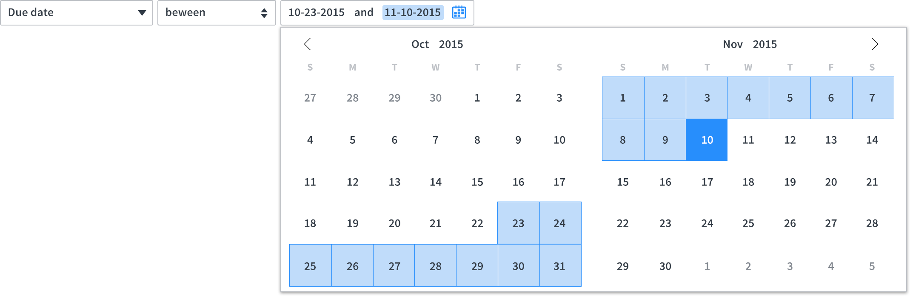
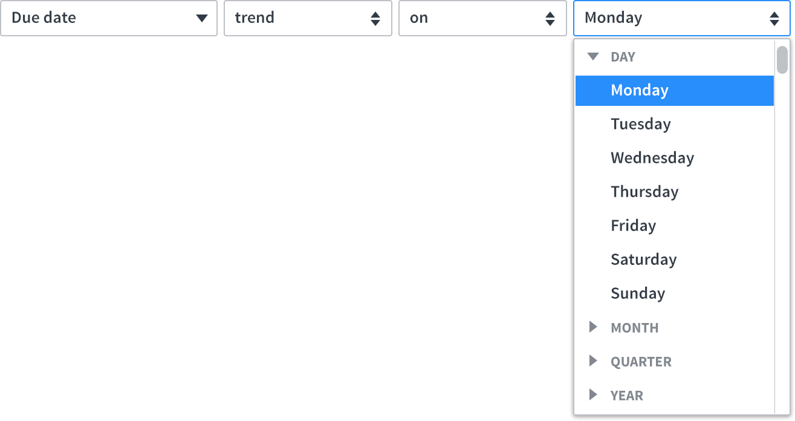
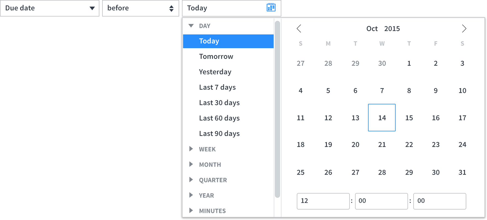
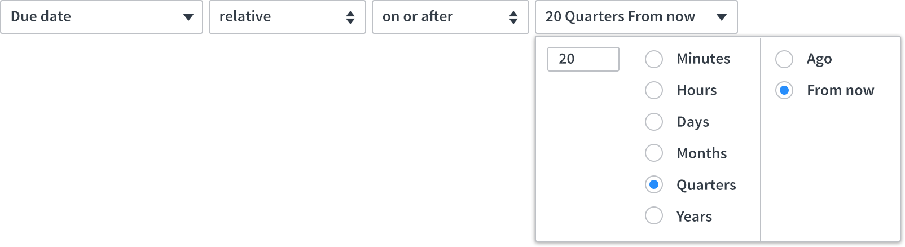

# Date Components

## Description

Calendar and time pickers provide the option to select a value from a predetermined time or date range.

When including time and date options, use one of the following calendar and time pickers:
* Date Picker
* Relative Time Picker
* Time Input
* Combined Picker

    

## Date Picker
---
Use a date picker if an exact date or date range is required. Always provide the option for manual input.

    

## Relative Time Picker
---
Use a relative time picker if exact date and time range is not required.

    

## Time Input
---
Use time input if exact time (in hours, minutes, and seconds) is required. Time input automatically translates entries to the proper format if the user enters seconds or minutes greater than 60.

    

## Combined Picker
---
Use a combined picker if the following input is required:
* Relative time (range) or exact date
* Exact date and time
* Time and relative values (such as Today selected below)

     

