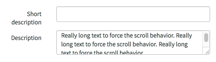
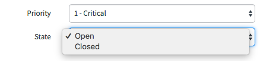
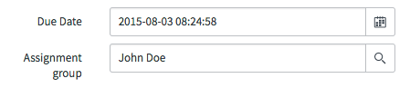
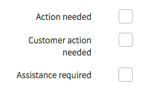

# Input Components

## Description

fields allow the user to input data when creating a record. Use form fields when:

* Displaying records
* Creating new records
* Editing existing records

Because form fields validate user data, each field type includes a set of input requirements.

Before choosing the appropriate type of form field, determine the type of data to be collected from the user.

Four field types:

* Text Inputs
* Selections ( Drop-downs )
* Segmented Controls
* Boolean Controls ( See 'Choice Toggles' for more info )

<p><br/><br/><br/><br/></p>

## Text Inputs
---
Text inputs require direct user input in alphanumeric format. 



```HTML
<form class="form-horizontal">
  <div class="form-group">
    <label class="col-xs-12 col-md-3 control-label">
      <span class="label-text">Short description</span>
    </label>
    <div class="col-xs-12 col-md-9 form-field input_controls">
      <input value="Unknown source of SAP outage" class="form-control" />
    </div>
  </div>
  <div class="form-group">
    <label class="control-label col-xs-12 col-md-3">Description</label>
    <div class="col-xs-12 col-md-9 form-field">
      <div class="sn-stream-textarea-container">
        <textarea class="form-control">Several hours ago we experienced a flood of incidents related to various SAP applications. It has been determined that there is an outage of unknown origin. We are performing root cause analysis.</textarea>
      </div>
    </div>
  </div>
</form>
```

<p><br/><br/><br/><br/></p>

## Plain Selection
---
Selections provide the user with a dropdown list of options.



```HTML
<form class="form-horizontal">
  <div class="form-group">
    <label class="col-xs-12 col-md-3 control-label">
      <span class="label-text">Priority</span>
    </label>
    <div class="col-xs-12 col-md-9 form-field input_controls">
      <select class="form-control">
        <option>1 - Critical</option>
        <option>2 - Meh</option>
        <option>3 - Somday</option>
      </select>
    </div>
  </div>
  <div class="form-group">
    <label class="col-xs-12 col-md-3 control-label">
      <span class="label-text">State</span>
    </label>
    <div class="col-xs-12 col-md-9 form-field input_controls">
      <select class="form-control">
        <option>Open</option>
        <option>Closed</option>
      </select>
    </div>
  </div>
</form>
```

<p><br/><br/><br/><br/></p>

## Segmented Controls
---
Segmented controls combine text inputs and selections, allowing the user to manually enter text or select from a list of options. A selected option replaces manually entered text. If partially entered text matches a selectable option, display available suggestions.



```HTML
<form class="form-horizontal">
  <div class="form-group">
    <label class="col-xs-12 col-md-3 control-label">
      <span class="label-text">Due Date</span>
    </label>
    <div class="col-xs-12 col-md-9 form-field input_controls">
      <div class="element date-calendar">
        <span class="input-group">
          <input type="text" class="form-control text-align-right-ltr element_reference_input" value="2015-08-03 08:24:58">
          <span class="input-group-btn">
            <a href="javascript:void(0)" class="btn btn-default btn-ref">
              <span class="icon-calendar"></span>
            </a>
          </span>
        </span>
      </div>
    </div>
  </div>
  <div class="form-group">
    <label class="col-xs-12 col-md-3 control-label">
      <span class="label-text">Assignment group</span>
    </label>
    <div class="col-xs-12 col-md-9 form-field input_controls">
      <div class="input-group ref-container">
        <input type="text" value="Ernesto Ayala" class="form-control element_reference_input">
        <span class="input-group-btn sn-reference-selector-container input-group-btn">
          <button type="button" class="btn btn-default icon icon-search"></button>
        </span>
      </div>
    </div>
  </div>
</form>
```

<p><br/><br/><br/><br/></p>

## Boolean Controls
---
Boolean controls can appear as checkboxes or switches. Refer to 'Choice Toggles' to determine the appropriate control depending on the desired input.

