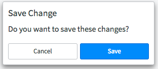
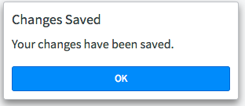
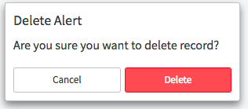
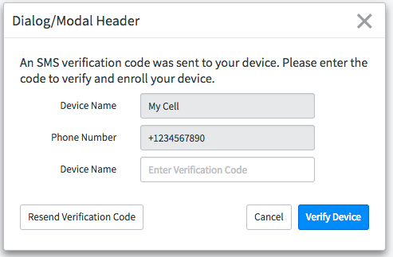
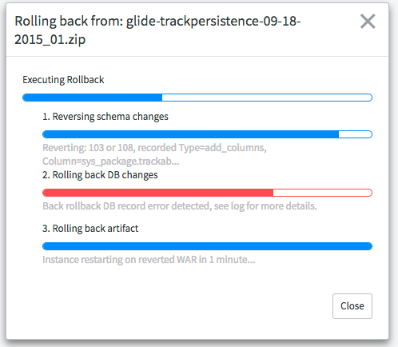

# Modals

## Description

Modals are used to deliver information to the user and to prompt action. They must be isolated from the current view to focus the user’s attention.

Use modals to:

* Accept input from the user.
* Make selections from outside data sources without leaving the current view.
* Display progress of the user’s actions.

---
The following section describes the different types of modals and their respective usage.
Dialogs
Dialogs are a type of modal used to confirm information from the user, notify the user of progress or change, or request input.

<p><br/><br/><br/><br/><br/></p>
---
## Confirmation Dialogs


Confirmation dialogs require the user to explicitly accept or reject an action before continuing. Use confirmation dialogs to confirm a user’s intention.

```HTML
<div class="modal-example">
	<div class="modal">
		<div class="modal-dialog modal-sm modal-alert">
			<div class="modal-content">
				<header class="modal-header">
					<h4 id="modal1_title" class="modal-title">Save Change</h4>
				</header>
				<div class="modal-body">
					<p>Do you want to save these changes?</p>
				</div>
				<footer class="modal-footer flex">
					<button class="btn btn-default">Cancel</button>
					<button class="btn btn-primary">Save</button>
				</footer>
			</div>
		</div>
	</div>
</div>
```

<p><br/><br/><br/><br/><br/></p>
---
## Information Dialogs


Information dialogs notify a user of important information. Use information dialogs to deliver important information that the user must confirm to proceed.
```HTML
<div class="modal-example">
	<div class="modal">
		<div class="modal-dialog modal-sm modal-alert">
			<div class="modal-content">
				<header class="modal-header">
					<h4 id="modal1_title" class="modal-title">Changes Saved</h4>
				</header>
				<div class="modal-body">
					<p>Your changes have been saved.</p>
				</div>
				<footer class="modal-footer flex">
					<button data-dismiss="modal" class="btn btn-primary">OK</button>
				</footer>
			</div>
		</div>
	</div>
</div>
```

<p><br/><br/><br/><br/><br/></p>
---
## Destructive Dialogs


Destructive dialogs notify the user of a destructive choice.  Use destructive dialogs to confirm a user’s destructive intention.
```HTML
<div class="modal-example">
	<div class="modal">
		<div class="modal-dialog modal-sm modal-alert">
			<div class="modal-content">
				<header class="modal-header">
					<h4 id="modal1_title" class="modal-title">Delete Alert</h4>
				</header>
				<div class="modal-body">
					<p>Are you sure you want to delete record?</p>
				</div>
				<footer class="modal-footer flex">
					<button data-dismiss="modal" class="btn btn-default">Cancel</button>
					<button data-dismiss="modal" class="btn btn-danger">Delete</button>
				</footer>
			</div>
		</div>
	</div>
</div>
```

<p><br/><br/><br/><br/><br/></p>
---
## Option Modal


Option dialogs prompt the user for information through input fields, drop downs, radio buttons, switches, checkboxes, and other form elements. Option dialogs include responsive fields that check validity and save user input. Use option dialogs to collect required information from the user.
```HTML
<div class="modal-example">
	<div class="modal">
		<div class="modal-dialog small-modal">
			<div class="modal-content">
				<div class="modal-header">
					<button data-dismiss="modal" class="btn-icon close icon-cross">
					 <span class="sr-only">Close</span>
					</button>
					<h4 class="modal-title">Dialog/Modal Header</h4>
				</div>
				<div class="modal-body">
					<div class="row">
						<div class="col-sm-12">
							<p>An SMS verification code was sent to your device. Please enter the code to verify and enroll your device.</p>
						</div>
					</div>
					<div class="row">
						<div class="form-horizontal">
							<div class="form-group">
								<label for="theInput" class="col-sm-3 col-sm-offset-1 control-label">Device Name</label>
								<div class="col-sm-6">
									<input type="text" class="form-control" id="theInput" value="My Cell" disabled>
								</div>
							</div>
							<div class="form-group">
								<label for="thePhone" class="col-sm-3 col-sm-offset-1 control-label">Phone Number</label>
								<div class="col-sm-6">
									<input type="text" class="form-control" id="theInput" value="+1234567890" disabled>
								</div>
							</div>
							<div class="form-group">
								<label for="theVerify" class="col-sm-3 col-sm-offset-1 control-label">Device Name</label>
								<div class="col-sm-6">
									<input type="text" class="form-control" id="theVerify" value="" placeholder="Enter Verification Code">
								</div>
							</div>
						</div>
					</div>
				</div>
				<div class="modal-footer">
					<div class="row">
						<div class="col-sm-6">
							<button class="btn btn-default pull-left">Resend Verification Code</button>
						</div>
						<div class="col-sm-6">
							<button class="btn btn-default">Cancel</button>
							<button class="btn btn-primary">Verify Device</button>
						</div>
					</div>
				</div>
			</div>
		</div>
	</div>
</div>
```

<p><br/><br/><br/><br/><br/></p>
---
## Custom Modal


Custom dialogs can include interactive and non-interactive components that indicate progress, load actions, and updates. Custom dialogs are temporary and close automatically once the action completes. Use custom dialogs to display temporary information to the user.

```HTML
<div class="modal-example">
	<div class="modal">
		<div class="modal-dialog small-modal">
			<div class="modal-content">
				<div class="modal-header">
					<button data-dismiss="modal" class="btn-icon close icon-cross">
					 <span class="sr-only">Close</span>
					</button>
					<h4 id="small_modal1_title" class="modal-title">Rolling back from: glide-trackpersistence-09-18-2015_01.zip</h4>
				</div>
				<div class="modal-body">
					<div class="row progress-container-primary">
						<div class="col-sm-12">
							<p>Executing Rollback</p>
							<div class="progress">
								<div class="progress-bar" editrole="progressbar" style="width: 40%;" aria-valuemin="0" aria-valuenow="50" aria-valuemax="100">
									<span class="sr-only">40%</span>
								</div>
							</div>
						</div>
					</div>
					<div class="row progress-container-secondary">
						<div class="col-sm-12">
							<p class="progress-title">1. Reversing schema changes</p>
							<div class="progress">
								<div class="progress-bar" role="progressbar" style="width: 90%;" aria-valuemin="0" aria-valuenow="50" aria-valuemax="100">
									<span class="sr-only">90%</span>
								</div>
							</div>
							<span class="description">Reverting: 103 or 108, recorded Type=add_columns, Column=sys_package.trackab...</span>
						</div>
					</div>
					<div class="row progress-container-secondary">
						<div class="col-sm-12">
							<p>2. Rolling back DB changes</p>
							<div class="progress progress-danger">
								<div class="progress-bar progress-bar-danger" role="progressbar" style="width: 70%;" aria-valuemin="0" aria-valuenow="50" aria-valuemax="100">
									<span class="sr-only">70%</span>
								</div>
							</div>
							<span class="description">Back rollback DB record error detected, see log for more details.</span>
						</div>
					</div>
					<div class="row progress-container-secondary">
						<div class="col-sm-12">
							<p>3. Rolling back artifact</p>
							<div class="progress">
								<div class="progress-bar" role="progressbar" style="width: 100%;" aria-valuemin="0" aria-valuenow="50" aria-valuemax="100">
									<span class="sr-only">100%</span>
								</div>
							</div>
							<span class="description">Instance restarting on reverted WAR in 1 minute...</span>
						</div>
					</div>
				</div>
				<div class="modal-footer">
					<div class="row">
						<div class="col-sm-12">
							<button class="btn btn-default">Close</button>
						</div>
					</div>
				</div>
			</div>
		</div>
	</div>
</div>
```