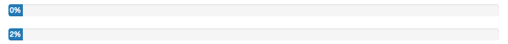
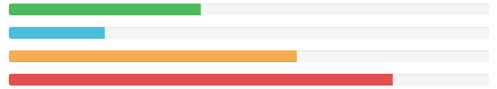
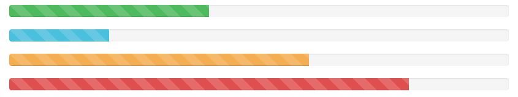

# Progress Bars

## Description

Provide up-to-date feedback on the progress of a workflow or action with simple yet flexible progress bars.

<p><br/><br/><br/><br/><br/></p>

---
## Basic example
Default progress bar.


```HTML
<div class="progress">
  <div class="progress-bar" role="progressbar" aria-valuenow="60" aria-valuemin="0" aria-valuemax="100" style="width: 60%;">
    <span class="sr-only">60% Complete</span>
  </div>
</div>
```

<p><br/><br/><br/><br/><br/></p>

---
## With label
Remove the `<span>` with `.sr-only` class from within the progress bar to show a visible percentage.


```HTML
<div class="progress">
  <div class="progress-bar" role="progressbar" aria-valuenow="60" aria-valuemin="0" aria-valuemax="100" style="width: 60%;">
    60%
  </div>
</div>
```
To ensure that the label text remains legible even for low percentages, consider adding a min-width to the progress bar.



```HTML
<div class="progress">
  <div class="progress-bar" role="progressbar" aria-valuenow="0" aria-valuemin="0" aria-valuemax="100" style="min-width: 2em;">
    0%
  </div>
</div>
<div class="progress">
  <div class="progress-bar" role="progressbar" aria-valuenow="2" aria-valuemin="0" aria-valuemax="100" style="min-width: 2em; width: 2%;">
    2%
  </div>
</div>
```

<p><br/><br/><br/><br/><br/></p>

---
## Contextual alternatives
Progress bars use some of the same button and alert classes for consistent styles.



```HTML
<div class="progress">
  <div class="progress-bar progress-bar-success" role="progressbar" aria-valuenow="40" aria-valuemin="0" aria-valuemax="100" style="width: 40%">
    <span class="sr-only">40% Complete (success)</span>
  </div>
</div>
<div class="progress">
  <div class="progress-bar progress-bar-info" role="progressbar" aria-valuenow="20" aria-valuemin="0" aria-valuemax="100" style="width: 20%">
    <span class="sr-only">20% Complete</span>
  </div>
</div>
<div class="progress">
  <div class="progress-bar progress-bar-warning" role="progressbar" aria-valuenow="60" aria-valuemin="0" aria-valuemax="100" style="width: 60%">
    <span class="sr-only">60% Complete (warning)</span>
  </div>
</div>
<div class="progress">
  <div class="progress-bar progress-bar-danger" role="progressbar" aria-valuenow="80" aria-valuemin="0" aria-valuemax="100" style="width: 80%">
    <span class="sr-only">80% Complete (danger)</span>
  </div>
</div>
```

<p><br/><br/><br/><br/><br/></p>

---
## Striped
Uses a gradient to create a striped effect. Not available in IE9 and below.



```HTML
<div class="progress">
  <div class="progress-bar progress-bar-success progress-bar-striped" role="progressbar" aria-valuenow="40" aria-valuemin="0" aria-valuemax="100" style="width: 40%">
    <span class="sr-only">40% Complete (success)</span>
  </div>
</div>
<div class="progress">
  <div class="progress-bar progress-bar-info progress-bar-striped" role="progressbar" aria-valuenow="20" aria-valuemin="0" aria-valuemax="100" style="width: 20%">
    <span class="sr-only">20% Complete</span>
  </div>
</div>
<div class="progress">
  <div class="progress-bar progress-bar-warning progress-bar-striped" role="progressbar" aria-valuenow="60" aria-valuemin="0" aria-valuemax="100" style="width: 60%">
    <span class="sr-only">60% Complete (warning)</span>
  </div>
</div>
<div class="progress">
  <div class="progress-bar progress-bar-danger progress-bar-striped" role="progressbar" aria-valuenow="80" aria-valuemin="0" aria-valuemax="100" style="width: 80%">
    <span class="sr-only">80% Complete (danger)</span>
  </div>
</div>
```

<p><br/><br/><br/><br/><br/></p>

---
## Animated
Add .active to .progress-bar-striped to animate the stripes right to left. Not available in IE9 and below.


```HTML
<div class="progress">
  <div class="progress-bar progress-bar-striped active" role="progressbar" aria-valuenow="45" aria-valuemin="0" aria-valuemax="100" style="width: 45%">
    <span class="sr-only">45% Complete</span>
  </div>
</div>
```

<p><br/><br/><br/><br/><br/></p>

---
## Stacked
Place multiple bars into the same .progress to stack them.


```HTML
<div class="progress">
  <div class="progress-bar progress-bar-success" style="width: 35%">
    <span class="sr-only">35% Complete (success)</span>
  </div>
  <div class="progress-bar progress-bar-warning progress-bar-striped" style="width: 20%">
    <span class="sr-only">20% Complete (warning)</span>
  </div>
  <div class="progress-bar progress-bar-danger" style="width: 10%">
    <span class="sr-only">10% Complete (danger)</span>
  </div>
</div>