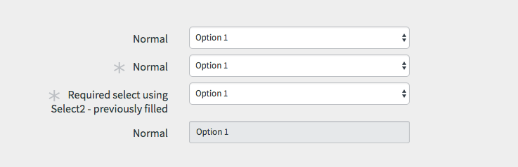
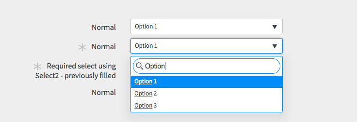

# Select (Drop-down)

## Description

Select elements are used for selecting one of the many options. Logically these controls provide the same functionality as radio buttons.

The main difference is that select elements are optimized for selecting from a larger lists of options.

There are two types of select elements:
* Select
* Select with Search


<p><br/><br/><br/><br/><br/></p>

---
## Select
Select works for relatively small lists of options that the user can easily scroll and look through.



```HTML
<div class="form-group">
  <div nowrap="true" type="string" choice="0" data-type="label">
    <label class="col-sm-12 col-md-4 control-label">
      <span class="label-text">Normal</span>
    </label>
  </div>
  <div class="col-sm-12 col-md-6 form-field input_controls">
    <select class="form-control">
      <option>Option 1</option>
      <option>Option 2</option>
      <option>Option 3</option>
    </select>
  </div>
  <div class="col-sm-12 col-md-2 form-field-addons"></div>
</div>
<div class="form-group is-filled">
  <div nowrap="true" type="string" choice="0" data-type="label">
    <label class="col-sm-12 col-md-4 control-label">
      <span class="required-marker"></span>
      <span class="label-text">Normal</span>
    </label>
  </div>
  <div class="col-sm-12 col-md-6 form-field input_controls">
    <select class="form-control">
      <option>Option 1</option>
      <option>Option 2</option>
      <option>Option 3</option>
    </select>
  </div>
  <div class="col-sm-12 col-md-2 form-field-addons"></div>
</div>
<div class="form-group is-prefilled">
  <div nowrap="true" type="string" choice="0" data-type="label">
    <label class="col-sm-12 col-md-4 control-label">
      <span class="required-marker"></span>
      <span class="label-text">Required select using Select2 - previously filled</span>
    </label>
  </div>
  <div class="col-sm-12 col-md-6 form-field input_controls">
    <select class="form-control">
      <option>Option 1</option>
      <option>Option 2</option>
      <option>Option 3</option>
    </select>
  </div>
  <div class="col-sm-12 col-md-2 form-field-addons"></div>
</div>
<div class="form-group">
  <div nowrap="true" type="string" choice="0" data-type="label">
    <label class="col-sm-12 col-md-4 control-label">
      <span class="label-text">Normal</span>
    </label>
  </div>
  <div class="col-sm-12 col-md-6 form-field input_controls">
    <select class="form-control" disabled="disabled">
      <option>Option 1</option>
      <option>Option 2</option>
      <option>Option 3</option>
    </select>
  </div>
  <div class="col-sm-12 col-md-2 form-field-addons"></div>
</div>
```
<p><br/><br/><br/><br/><br/></p>

---
## Select with Search
Select with search allows users to quickly browse a long list of choices.



```HTML
<div class="form-group">
  <div nowrap="true" type="string" choice="0" data-type="label">
    <label class="col-sm-12 col-md-4 control-label">
      <span class="label-text">Normal</span>
    </label>
  </div>
  <div class="col-sm-12 col-md-6 form-field input_controls">
    <select class="form-control select2">
      <option>Option 1</option>
      <option>Option 2</option>
      <option>Option 3</option>
    </select>
  </div>
  <div class="col-sm-12 col-md-2 form-field-addons"></div>
</div>
<div class="form-group is-filled">
  <div nowrap="true" type="string" choice="0" data-type="label">
    <label class="col-sm-12 col-md-4 control-label">
      <span class="required-marker"></span>
      <span class="label-text">Normal</span>
    </label>
  </div>
  <div class="col-sm-12 col-md-6 form-field input_controls">
    <select class="form-control select2">
      <option>Option 1</option>
      <option>Option 2</option>
      <option>Option 3</option>
    </select>
  </div>
  <div class="col-sm-12 col-md-2 form-field-addons"></div>
</div>
<div class="form-group is-prefilled">
  <div nowrap="true" type="string" choice="0" data-type="label">
    <label class="col-sm-12 col-md-4 control-label">
      <span class="required-marker"></span>
      <span class="label-text">Required select using Select2 - previously filled</span>
    </label>
  </div>
  <div class="col-sm-12 col-md-6 form-field input_controls">
    <select class="form-control select2">
      <option>Option 1</option>
      <option>Option 2</option>
      <option>Option 3</option>
    </select>
  </div>
  <div class="col-sm-12 col-md-2 form-field-addons"></div>
</div>
<div class="form-group">
  <div nowrap="true" type="string" choice="0" data-type="label">
    <label class="col-sm-12 col-md-4 control-label">
      <span class="label-text">Normal</span>
    </label>
  </div>
  <div class="col-sm-12 col-md-6 form-field input_controls">
    <select class="form-control select2" disabled="disabled">
      <option>Option 1</option>
      <option>Option 2</option>
      <option>Option 3</option>
    </select>
  </div>
  <div class="col-sm-12 col-md-2 form-field-addons"></div>
</div>
```

<p><br/><br/><br/><br/><br/></p>
