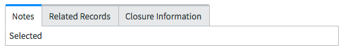
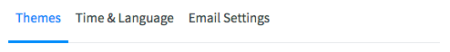
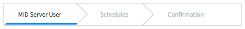
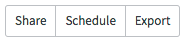

# Tab

## Description

Use tabs to split content into smaller sections for focus and clarity.

<p><br/><br/><br/><br/></p>

## Basic
---
Use basic tabs to separate large portions of content. 

Each tab should include a unifying trait, even if the content is logically unrelated.


```HTML
<div>
  <ul role="tablist" class="nav nav-tabs sn-tabs-basic">
    <li role="presentation" class="active">
      <a href class="active">Notes</a>
    </li>
    <li role="presentation">
      <a href>Related Records</a>
    </li>
    <li role="presentation">
      <a href>Closure Information</a>
    </li>
  </ul>
  <div class="tab-content">
    <div class="tab-pane active">Selected</div>
    <div class="tab-pane"></div>
    <div class="tab-pane"></div>
  </div>
</div
```

<p><br/><br/><br/><br/></p>

## Light
---
Light tabs are meant to be used as nested tabs or applied as a more subtle version of tabs where appropriate.


```HTML
<div class="sn-navhub">
  <div class="sn-navhub-content">
    <div class="btn sn-navhub-btn sn-navhub-btn_text state-active">Themes</div>
    <div class="btn sn-navhub-btn sn-navhub-btn_text">Time &amp; Language</div>
    <div class="btn sn-navhub-btn sn-navhub-btn_text">Email Settings</div>
  </div>
</div>
```

<p><br/><br/><br/><br/></p>

## Guided
---
Guided tabs are specialized versions of light tabs and indicate a sequential relationship between the content presented. 

In guided tabs, the user is led through the content, with the first tab displayed before any successive tab.


```HTML
<ol class="process-breadcrumb process-breadcrumb-border">
  <li class="active">
    <a href>MID Server User</a>
  </li>
  <li class="disabled">
    <a href>Schedules</a>
  </li>
  <li class="disabled">
    <a href>Confirmation</a>
  </li>
</ol>
```

<p><br/><br/><br/><br/></p>

## Segmented
---
Use segmented controls as an alternative to light tabs. 

Segmented controls filter content into categories and display a group of options based on user selection.


```HTML
<ul class="nav nav-segmented sn-tabs-basic">
  <li>
    <a href>Share</a>
  </li>
  <li>
    <a href>Schedule</a>
  </li>
  <li>
    <a href>Export</a>
  </li>
</ul>
```

<p><br/><br/><br/><br/><br/></p>
