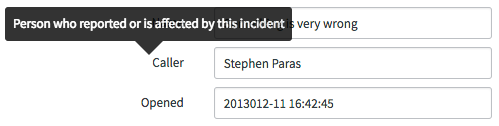

# Tooltip

## Description

Tooltips describe UI elements, controls, and actions that may not be clear to a user.

A tooltip can appear when you hover over an item that needs explanation after a configured delay time.

By default, tooltips open above the referenced element (with the tooltip arrow pointing down). However, if sufficient space is not available in the viewport, the tooltip will open below the element (with the tooltip arrow pointing up).

**Note** Don’t overuse tooltips. Most functions of an application should be easy to understand by default.

<p><br/><br/><br/><br/></p>

## Tooltip
<a id="tooltip"></a>


```HTML
<div class="tooltip fade top in fakeclass">
  <div class="tooltip-arrow"></div>
  <div class="tooltip-inner">Favorites</div>
</div>
```

<p><br/><br/><br/><br/></p>

## Form Tooltip
<a id="form-tooltip"></a>
Use a tooltip to provide a clear description of the associated form field.



```HTML
<div class="col-md-6 form-horizontal ng-scope" style="font-size: 13px; margin-left: 90px;">
  <div class="form-group">
    <label for="field1" class="control-label col-sm-3">Name</label>
    <span class="col-sm-9 form-field">
      <input id="field1" class="col-sm-9 form-control" type="text" placeholder="Placeholder Text" name="field1" value="Something is very wrong">
    </span>
  </div>
  <div class="form-group">
    <label for="field1" class="control-label col-sm-3">Caller</label>
    <span class="col-sm-9 form-field">
      <input id="field1" class="col-sm-9 form-control" type="text" placeholder="Placeholder Text" name="field1" value="Stephen Paras">
    </span>
    <div class="tooltip fade top in" style="top: -11px; left: -91px; display: block;">
      <div class="tooltip-arrow" style="left: 50%;"></div>
      <div class="tooltip-inner">Person who reported or is affected by this incident</div>
    </div>
  </div>
  <div class="form-group">
    <label for="field1" class="control-label col-sm-3">Opened</label>
    <span class="col-sm-9 form-field">
      <input id="field1" class="col-sm-9 form-control" type="text" placeholder="Placeholder Text" name="field1" value="2013012-11 16:42:45">
    </span>
  </div>
</div>
```

<p><br/><br/><br/><br/><br/></p>
